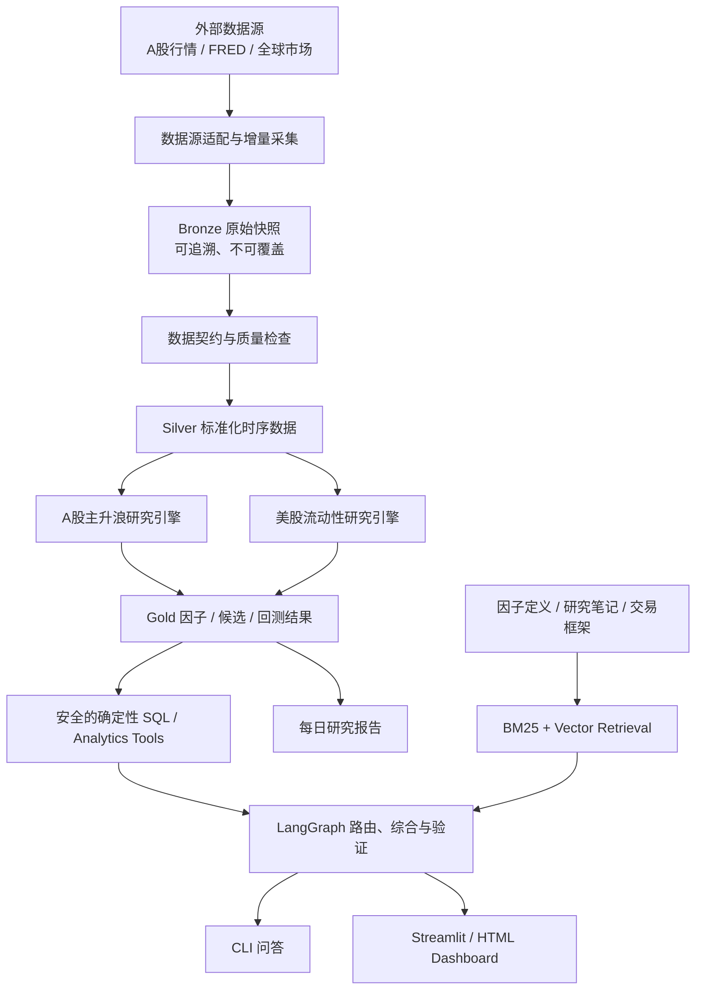

# Quant Analyst RAG Agent

一个面向真实市场数据的、可解释的量化研究与 RAG 问答项目。

项目不是让大模型直接“预测股票”，而是先用可复现的数据管道、因子规则和回测产生证据，再由 LangGraph Agent 调用确定性工具，回答“为什么入选、历史是否有效、当前流动性处于什么状态”等问题。

> 项目目标：在能够完整运行并持续产出日报的前提下，分模块掌握数据工程、量化研究、回测、RAG、Agent 与工程测试，并能在面试中讲清楚每个技术选择和失败边界。

## 1. 当前状态

仓库目前已经从样例 Agent 扩展出两条可运行的研究 vertical slice：

- LangGraph 显式工作流与确定性路由；
- SQLite 安全参数化查询；
- BM25 + 本地向量检索；
- 因子、回测、市场状态和异常日志工具；
- 回答证据校验与路由、检索、grounding 测试；
- CLI 可完成索引构建和样例问答。
- Phase 0 A 股主升浪标签、量价/相对强度/筹码代理 baseline；
- Phase 1 Bronze/Silver/Gold SQLite 数据契约、幂等发布和质量阻断；
- Phase 2 可解释 `WaveScore` 候选池与排除原因；
- Phase 3 无未来数据的周频回测与 weekly document lifecycle；
- selloff repair / reversal screen，用于急跌后的强势修复候选；
- 宏观 point-in-time features、四类规则模型、时效性风险文档和 liquidity transmission 仪表盘。
- 付费订阅/私人宏观材料的 local-first ingestion、观点卡、Kimi egress policy 与 hash-only audit。
- Phase A canonical search：typed query contract、Markdown 幂等迁移、中文 SQLite FTS5、outbox worker 与统一 `quant-agent search`。

当前版本已经跑通小规模真实数据，但尚不能视为生产交易系统。下一阶段重点是扩大历史覆盖、验证规则稳定性、补充数据源 fallback，并把宏观和 A 股结果接入统一检索入口。

## 2. 两条核心业务主线

### 主线 A：A 股主升浪候选挖掘

对可交易 A 股股票进行日频数据清洗、特征计算、规则筛选、排序和历史验证，每个交易日输出一个有明确入选理由和风险说明的候选池。

这里的“主升浪”不是事后观察到的大涨，也不是模型承诺未来上涨，而是一个可以在当日收盘后计算、次日执行并接受回测检验的操作性定义：

```text
可交易性合格
+ 中期上升趋势成立
+ 接近或突破阶段新高
+ 相对大盘与行业走强
+ 量价配合
+ 动量正在改善
- 过热、剧烈波动和流动性风险
```

第一版目标是做出可解释的规则系统，不急于使用黑盒机器学习。规则有效后，再研究学习排序、因子权重训练和文本催化剂。

### 主线 B：全球宏观 / 美股流动性监测

将美联储资产负债表、财政部现金余额、隔夜逆回购、美元、利率、信用利差、波动率与美股价格数据对齐，生成每日可解释的流动性状态、变化方向和风险提示。

第一版回答三个问题：

1. 当前美元流动性环境偏宽松、中性还是偏紧？
2. 最近一周和一个月是改善还是恶化，主要贡献项是什么？
3. 该状态与标普 500、纳斯达克等风险资产的历史表现有什么关系？

宏观指标的发布频率并不都是真正的日频。因此“每日分析”表示每天用当时可获得的最新数据更新判断，不能把周频数据伪装成当天新观测，也不能使用尚未发布的数据。

### 暂不作为 MVP 主线

- 港股横截面选股；
- 美股个股因子筛选；
- 分钟级行情与实盘自动交易；
- 端到端黑盒涨跌预测；
- 复杂组合优化与交易撮合模拟。

这些内容可以在两条主线稳定产出后扩展，避免项目范围失控。

## 3. 最终可见产出

项目是否成功，不以“写了多少代码”衡量，而以能否稳定生成以下结果衡量。

### A 股候选池日报

建议输出到 `reports/daily/`：

- `cn_wave_candidates_YYYY-MM-DD.csv`：当日候选、总分、各维度得分、行业和风险标签；
- `cn_wave_report_YYYY-MM-DD.md`：Top N 候选及每只股票的入选 / 排除证据；
- `cn_wave_backtest.html`：策略净值、基准、回撤、换手、胜率和分阶段表现；
- `cn_wave_data_quality_YYYY-MM-DD.json`：停牌、缺失、重复、异常价格和陈旧数据检查。

日报必须能回答：数据截至何时、股票为什么入选、什么条件会使它失效、规则历史表现如何。

### 美股流动性日报

建议输出到 `reports/daily/`：

- `us_liquidity_snapshot_YYYY-MM-DD.json`：指标原值、发布日期、最新观测日、变化量和标准分；
- `us_liquidity_report_YYYY-MM-DD.md`：状态、边际变化、贡献拆解、市场验证与数据陈旧提示；
- `us_liquidity_dashboard.html`：净流动性、分项指标、风险资产和历史状态区间；
- `us_liquidity_backtest.html`：不同流动性状态下美股未来收益的统计分布。

日报必须区分“事实”“规则计算”“历史统计”和“解释”，不把相关性写成因果性。

当前宏观 MVP 实际输出位于 `outputs/macro/`：

- `macro_snapshot_YYYY-MM-DD.json`：机器可读 snapshot 与 document；
- `macro_report_YYYY-MM-DD.md`：风险、流动性来源和跨资产吸收代理；
- `macro_dashboard_YYYY-MM-DD.html`：WALCL/TGA/RRP source decomposition 与资产流动性传导图。

宏观输出现在按三层组织：`MacroRegime` 描述数周至数月约束，`MarketThemeState`
识别 1–5 日跨资产交易主题与 14 日重定价主题，RAG / LLM 只负责结合研究和政策材料解释
主题。HTML dashboard 可切换 horizon 和候选主题，并展示支持证据、冲突与失效条件。

宏观模块默认同时重建 14 calendar days、约 10–11 个 weekday point-in-time snapshots，用来识别净流动性转向、risk/rate constraint 变化和 target absorption rotation。历史与推断分别写入：

- `macro_snapshots_history`；
- `macro_target_history`；
- `macro_change_events`；
- `macro_pricing_inferences`。

Kimi 只在 deterministic change event 出现时读取 compact 14D packet，并输出可证伪 pricing hypothesis；它不读取 HTML、不调用同花顺、不重算 numeric evidence。

对于付费订阅或私人渠道材料，原始文件不会进入通用 RAG store，也不会默认发送给 Kimi。系统只发布人工批准、non-verbatim 的 `MacroViewpoint`，再由 egress policy 决定是否允许 Kimi 读取抽象观点或明确授权的短摘录。完整设计、权限状态机和运行命令见 [Private Material Intelligence](docs/private-material-intelligence.md)。

真实 observations 与发布批次保存在 `data/processed/phase1_research.db` 的
`macro_source_observations` / `macro_source_runs`；RAG 时效文档保存在
`macro_risk_documents` / `macro_document_chunks`。

运行固定 fixture：

```bash
PYTHONPATH=src .venv/bin/python -m quant_agent.cli.run_macro_regime
```

刷新真实 FRED/CBOE/AkShare 数据，或使用最后一次成功 cache 重算：

```bash
PYTHONPATH=src .venv/bin/python -m quant_agent.cli.run_macro_regime --live --as-of 2026-07-15
PYTHONPATH=src .venv/bin/python -m quant_agent.cli.run_macro_regime --live --reuse-cache --as-of 2026-07-15 --history-days 14
PYTHONPATH=src .venv/bin/python -m quant_agent.cli.run_macro_regime --live --reuse-cache --as-of 2026-07-15 --history-days 14 --with-kimi
```

CLI 默认要求至少 50% core coverage 才发布新 finalized document；不足时上一版继续有效。

### Canonical Knowledge Search（Phase A）

SQLite `KnowledgeStore` 现在是文档检索的 canonical source。首次运行会把 `data/docs/**/*.md` 幂等迁移为 versioned `KnowledgeDocument/KnowledgeChunk`，消费 transactional outbox 并建立中文/英文 FTS5 index：

```bash
.venv/bin/python -m pip install . --no-deps --no-build-isolation
quant-agent index migrate-markdown
quant-agent index sync
quant-agent index status
quant-agent search "韩国加息是否导致亚洲半导体下跌？" --as-of 2026-07-17 --top-k 6
```

搜索默认只返回当时已可见的 `FINALIZED` evidence，不调用 Kimi。完整 contract、幂等语义和验收记录见 [Phase A Canonical Search](docs/phase-a-canonical-search.md)。

## 4. 总体架构



架构的关键边界：

- 数据层保存事实和时间语义；
- 研究引擎负责计算信号和统计验证；
- SQL / Analytics Tool 提供数字证据；
- Retrieval 提供定义、背景和研究笔记；
- LLM 只做路由、解释和自然语言组织，不生成任意 SQL，不暗中重算指标。

## 5. 目标代码结构

现有 `graph/`、`retrieval/`、`tools/` 和 `evaluation/` 会继续保留；真实数据模块按以下结构逐步加入，而不是一次性全部生成。

```text
quant-analyst-rag-agent/
├── configs/
│   ├── cn_wave_v1.yaml               # 筛选阈值、权重和持有规则
│   └── us_liquidity_v1.yaml          # 指标方向、窗口和权重
├── data/
│   ├── raw/                           # Bronze：带采集批次的原始快照
│   ├── interim/                       # Silver：标准化、复权、频率对齐数据
│   ├── processed/                     # Gold：SQLite、因子和研究结果
│   └── docs/                          # 因子定义、研究笔记和框架文档
├── reports/
│   ├── daily/
│   └── backtests/
├── src/quant_agent/
│   ├── data_sources/
│   │   ├── base.py                    # 数据源协议、重试和错误模型
│   │   ├── cn_market.py               # A股数据适配器
│   │   ├── fred.py                    # 宏观数据适配器
│   │   └── global_market.py           # 指数、利率、美元和波动率
│   ├── ingestion/
│   │   ├── market_pipeline.py
│   │   ├── macro_pipeline.py
│   │   └── quality_checks.py
│   ├── database/
│   │   ├── schema.py
│   │   ├── repositories.py
│   │   └── migrations.py
│   ├── research/
│   │   ├── cn_wave/
│   │   │   ├── universe.py
│   │   │   ├── features.py
│   │   │   ├── screener.py
│   │   │   ├── scoring.py
│   │   │   └── backtest.py
│   │   └── us_liquidity/
│   │       ├── align.py
│   │       ├── features.py
│   │       ├── index.py
│   │       ├── regime.py
│   │       └── validation.py
│   ├── tools/
│   │   ├── cn_screening_tool.py
│   │   ├── liquidity_tool.py
│   │   └── market_evidence_tool.py
│   ├── llm/
│   │   └── kimi_client.py              # 可选 Kimi 叙事抽取 provider
│   ├── graph/                          # 已有 LangGraph 工作流，增加新路由
│   ├── retrieval/                      # 已有 BM25 + Vector
│   ├── reporting/
│   │   ├── cn_daily_report.py
│   │   └── liquidity_daily_report.py
│   ├── evaluation/
│   └── cli/
└── tests/
    ├── fixtures/                       # 小而固定，不依赖网络
    ├── unit/
    ├── integration/
    └── research/
```

## 6. 数据工程约定

### 数据源策略

通过统一 adapter 隔离第三方接口，业务代码不直接依赖某一家供应商。

| 数据 | 第一选择 | 备用 / 后续 | 关键处理 |
| --- | --- | --- | --- |
| A 股日线、交易日历、证券信息 | AkShare adapter | BaoStock；有 Token 时可加 Tushare | 前 / 后复权、停牌、退市、代码标准化 |
| 美联储与美国宏观时序 | FRED adapter | 官方源补充 | 观测日、发布日期、频率、修订版本 |
| 美股指数、美元、利率、VIX 等市场数据 | Global market adapter | 可替换供应商 | 时区、交易日和缺失值 |
| 行业与主题映射 | 本地版本化 CSV 起步 | 后续自动同步 | 生效日期和历史成分 |

`.env` 只保存密钥，不提交真实 Token。每条记录至少保存 `source`、`observation_date`、`available_at`、`ingested_at` 和 `run_id`。

### 三层数据模型

- **Bronze**：保留原始响应或原始表，不覆盖历史采集批次，用于排错和复现；
- **Silver**：统一代码、日期、单位、币种、复权方式和缺失值语义；
- **Gold**：保存因子值、排名、候选、流动性状态、回测和报告证据。

### 核心表

| 表 | 粒度 | 用途 |
| --- | --- | --- |
| `symbols` | 证券 + 生效区间 | 市场、行业、上市 / 退市和基准映射 |
| `market_prices_daily` | 证券 × 交易日 | 标准化 OHLCV、成交额和复权字段 |
| `macro_observations` | 指标 × 观测日 × 版本 | 原值、单位、频率、可用时间和数据源 |
| `ingestion_runs` | 采集任务 | 状态、耗时、行数、时间范围和错误 |
| `data_quality_checks` | 批次 × 检查项 | 缺失、重复、异常、陈旧与严重级别 |
| `factor_values_daily` | 证券 × 日期 × 因子 | 原值、截面排名、版本和参数 |
| `cn_screen_results` | 日期 × 证券 | 是否入选、总分、分项分和排除原因 |
| `liquidity_features` | 日期 × 指标 | 原值、变化、z-score、陈旧天数和贡献 |
| `liquidity_regimes` | 日期 | 综合分、状态、置信度和模型版本 |
| `backtest_results` | 策略版本 × 区间 | 收益、回撤、换手、胜率和分组统计 |

### 必须先于研究结果通过的检查

- 主键重复、字段类型和 OHLC 价格关系；
- 成交量 / 成交额非负、价格跳变和复权连续性；
- 交易日覆盖、停牌与真实缺失的区分；
- 数据是否过期、是否发生部分拉取；
- 宏观单位是否统一，周频 / 月频数据是否只从实际可用日开始使用；
- 增量更新与同一输入的重复运行是否幂等。

严重错误必须阻止 Gold 层更新，不能带病生成“看起来正常”的报告。

## 7. A 股主升浪研究框架 V1

### 7.1 股票池与硬过滤

第一版从全 A 股日线开始，但先通过硬过滤得到可交易研究池：

- 排除 ST / 退市整理等特殊状态；
- 排除上市时间过短的股票；
- 排除长期停牌和数据陈旧股票；
- 设置最近 20 日平均成交额下限；
- 对涨跌停无法成交的情形在回测中显式处理；
- 行业映射缺失可以保留，但必须打质量标签。

股票池和过滤条件均按日期重建，尽量减少只使用“今天仍然存在的股票”造成的幸存者偏差。

### 7.2 第一版特征

| 维度 | 候选特征 | 要回答的问题 |
| --- | --- | --- |
| 趋势 | `close/MA20/MA60/MA120`、均线斜率 | 中期上升结构是否成立？ |
| 突破 | 距 20 / 60 / 120 日高点、突破幅度 | 是否正在脱离整理区？ |
| 动量 | 20 / 60 日收益、动量差分 | 涨势是否在加速而非衰减？ |
| 相对强弱 | 相对沪深 300、相对行业收益 | 是市场普涨还是个股真正走强？ |
| 量价 | 量比、成交额分位、上涨日放量 | 突破是否得到交易行为确认？ |
| 风险 | 波动率、ATR、距均线偏离、60 日回撤 | 是否已经过热或风险不可控？ |

第一版总分可以采用“硬过滤 + 透明加权评分”：

```text
WaveScore = 趋势 25%
          + 突破 20%
          + 相对强弱 20%
          + 量价确认 15%
          + 动量改善 10%
          + 风险质量 10%
```

权重只是 V1 的研究假设，必须写入配置、带版本号，并通过样本外测试和敏感性分析决定是否保留，不能因为某段历史回测好看而反复手调。

### 7.3 回测协议

- 日期 `t` 收盘后生成信号，最早使用 `t+1` 可成交价格；
- 明确持有期、调仓频率、Top N、等权方式和交易成本；
- 涨跌停、停牌和无成交量时不能假设顺利成交；
- 同时报告绝对收益和相对基准收益；
- 使用滚动 / walk-forward 切分，保留最终样本外区间；
- 对权重、阈值、持有期和市场阶段做敏感性分析；
- 除收益外必须报告最大回撤、换手、胜率、持仓数和行业集中度。

V1 研究目标不是证明“必然有效”，而是判断信号在哪些市场环境有效、何时失效，以及结果是否稳健到值得继续研究。

### 7.4 与产业链框架结合

仓库中的 [AI 硬件扩散链交易框架](../AI硬件扩散链交易框架.md) 将作为研究文档进入检索库。V1 先让技术面筛选独立运行，再把行业 / 产业链标签作为解释与二次排序证据，避免先有题材结论再倒推价格信号。

财务、公告和研报可以用于事后研究归档，但不进入 A 股主升浪 `leader_score`。尤其是交易异动公告，它通常由已经发生的价格波动触发，不能被重复包装成领先信号。

## 8. 全球宏观 / 美股流动性框架 V1

### 8.1 指标分层

| 层级 | 代表指标 | 作用 |
| --- | --- | --- |
| 核心美元流动性 | 美联储总资产、TGA、隔夜逆回购 | 构造可解释的基础净流动性代理 |
| 资金价格 | 政策利率、2Y / 10Y 美债收益率、实际利率 | 衡量资金成本和期限预期 |
| 美元与信用 | 美元指数、投资级 / 高收益信用利差 | 衡量全球美元压力和风险融资条件 |
| 市场压力 | VIX、MOVE 或可获得的替代指标 | 观察股债波动和去杠杆压力 |
| 风险资产验证 | S&P 500、Nasdaq、Russell 2000 | 检验流动性状态与市场表现的关系 |

基础净流动性代理从业界常见的可解释形式起步：

```text
Net Liquidity Proxy = Fed Assets - TGA - ON RRP
```

这只是代理变量，不是完整的美元流动性，也不直接等于股市涨跌。实现时必须统一量纲，记录各分项的真实观测频率和可用日期，并同时展示水平值与 1 周 / 4 周变化。

### 8.2 特征与综合状态

对每个指标计算：

- 最新原值和最近真实观测日；
- 1 日、1 周、4 周变化（只在频率允许时解释）；
- 滚动 z-score 与历史分位数；
- 对“宽松 / 收紧”方向统一后的贡献分；
- `staleness_days` 与数据质量标记。

第一版综合分使用透明、可配置的方向和权重，输出五档状态：

```text
强宽松 / 宽松 / 中性 / 收紧 / 强收紧
```

同时再输出边际方向：`improving / stable / deteriorating`。例如“水平仍宽松但最近四周恶化”比单一标签更有信息量。

### 8.3 历史验证

- 统计不同流动性状态下风险资产未来 1 / 5 / 20 日收益分布；
- 报告均值、中位数、胜率、样本数和置信区间；
- 做扩张窗口或 walk-forward 标准化，避免用未来全样本均值计算历史 z-score；
- 将 COVID、加息周期和流动性冲击等阶段单独展示；
- 检查不同指标权重、窗口和市场代理下结论是否稳定；
- 明确这是一套状态监测和风险解释框架，不把同期相关性包装成交易因果。

## 9. RAG 与 Agent 如何服务两条主线

### 查询路由

| 用户问题 | 路由 | 证据要求 |
| --- | --- | --- |
| “今天哪些 A 股入选？” | `cn_screening_tool` | 当日筛选表和数据截至时间 |
| “某股票为什么入选 / 被排除？” | 筛选工具 + 因子定义检索 | 分项数值、阈值、规则文档 |
| “这个规则历史表现如何？” | `backtest_tool` | 策略版本、区间、成本与指标 |
| “今天流动性为什么恶化？” | `liquidity_tool` | 分项变化、贡献和观测日期 |
| “TGA 为什么会影响流动性？” | Retrieval | 被索引的研究文档和来源 |
| “流动性改善是否一定利好纳指？” | SQL + Retrieval | 历史统计、样本数和限制说明 |

### 防幻觉规则

- 所有数字必须来自工具返回的数据行或确定性计算；
- 回答必须带 `as_of`、数据源和策略 / 指标版本；
- 没有当日结果时明确拒绝假装“最新”；
- 解释性问题可以检索研究文档，但不能用文档中的观点替代实时数值；
- SQL 仅允许白名单参数化查询，不执行 LLM 自由生成的 SQL；
- 验证节点检查证据是否支持结论，并暴露缺失与冲突。

### Kimi / 同花顺能力边界

项目支持把 Kimi API 作为可选的研究归档 provider：它可以整理已经采集的新闻、调研和财报文本，但输出不参与 A 股 `leader_score`，也不用于判断主力方向。交易异动公告默认从日频特征合并中排除。

必须区分两套产品：

- Allegretto 会员的 Kimi 产品端包含同花顺等专业数据库调用权益；
- Moonshot API 是独立按量计费的开发接口，会员额度与 API 额度不互通；
- API 的联网搜索来自公开网页搜索，不能默认等同于产品端同花顺专业数据库。

因此，同花顺专业数据库可以作为人工探索与数据核对入口；自动化数值行情仍使用可审计的数据 adapter。Kimi 不直接提供 `leader_score`，不判断主力方向，也不作为价格、成交额和资金数据的唯一真相源。详细决策见 `docs/adr/0003-kimi-provider-boundary.md`。

Kimi API Key 只配置在本地 `.env`：

```bash
cp .env.example .env
# 在本地编辑 .env，填写 MOONSHOT_API_KEY；不要发送到聊天、日志或提交到 Git。
```

当前 `KimiClient` 已实现 JSON Mode、结果字段校验、429 / 5xx 重试和密钥脱敏。等叙事文档采集模块完成后再接入批量抽取，不让模型在没有原文证据时自行联网补全。

## 10. 分阶段实施路线图

每一阶段都应保持主分支可运行，并留下一个可以演示的纵向切片。

### Phase 0：A 股主升浪研究基线（已实现）

**工作**

- 建立五段人工正样本、四段 hard negative 标签和 point-in-time 叙事证据表；
- 从真实前复权日线计算价格、量能、相对市场强度和筹码代理特征；
- 实现不含公告叙事加分的透明 `leader_score`、状态分类、证据覆盖率和风险标记；
- 生成 Parquet 特征表、CSV baseline 结果与 ADR 0002；
- 保留全市场排名、行业 / 题材 RS 等当前无法真实计算的字段为空。

**真实产出**

- `data/labels/leader_cases.csv`；
- `data/narratives/theme_events.csv`；
- `data/features/daily_features.parquet`；
- `baselines/phase0_leader_score.csv`；
- `docs/adr/0002-a-share-leader-baseline.md`。

**完成定义**

- 叙事证据只从 `available_at` 起向后生效；
- 数值特征可从原始行情重新生成；
- 缺失数据不按 0 分处理，结果公开 `score_coverage`；
- 规则与边界测试通过，旧有 RAG 样例测试不回归。

**面试可讲**：如何把“主升浪”转化为可证伪规则，以及如何防止标签、文本与横截面数据泄漏。

### Thesis lifecycle validation（最小纵向切片）

Phase 0 之后先加入轻量 thesis state machine：每天用结构化 market features 做确定性验证，只有状态变化才进入 retrieval 和 Kimi JSON update。相同状态变化、数值证据和上下文使用 SHA-256 cache，避免重复 token 消耗。

```text
market features
  -> validate_thesis_state
  -> status unchanged: stop
  -> status changed: retrieve at most 3 chunks
  -> cache hit: reuse JSON
  -> cache miss: Kimi, temperature=0, max_tokens=800
  -> key lifecycle states: render research note
```

本地 smoke test：

```bash
.venv/bin/python scripts/run_thesis_validation.py --ticker 300308.SZ --date 2025-07-15
```

应用只读取已经 export 到当前进程的 `MOONSHOT_API_KEY`，不会主动加载任何 dotenv 文件。mock case 是 `WATCHLIST -> THEME_WARMUP`，按规则无需调用 LLM。

### Phase 1：数据契约与最小真实数据链路（pilot 已实现）

**工作**

- 定义 `DataSource` 协议、时间字段、异常和重试语义；
- 建立 Bronze / Silver / Gold 目录与真实数据表；
- 只选少量 A 股和少量宏观指标跑通全链路；
- 实现幂等增量更新和质量检查。

**真实产出**：一份包含来源、采集批次、缺失检查的小型真实 SQLite 数据库。

当前 `data/processed/phase1_research.db` 包含 ingestion runs、Bronze 原始记录、Silver 标准化日线/宏观观测、Gold 研究表、quality checks 和 dataset versions。A 股使用 8 只研究样本与沪深300真实缓存；宏观使用 FRED 的 WALCL、WTREGEN、RRPONTSYD。

**完成定义**：断网 fixture 测试可复现；重复运行不产生重复行；部分失败不会污染上一版 Gold 数据。

**面试可讲**：第三方数据不稳定时，adapter、数据契约与可观测性如何保护下游。

### Phase 2：A 股筛选 MVP（pilot 已实现）

**工作**

- 建立按日期生效的股票池和可交易性过滤；
- 实现趋势、突破、动量、相对强弱、量价和风险特征；
- 生成带排除原因的 `WaveScore`；
- 输出第一份真实候选池 CSV 和 Markdown 日报。

**真实产出**：每天可以重跑、每个候选都能解释的 A 股 Top N 列表。

当前产出位于 `outputs/phase2/`。横截面排名严格命名为 pilot rank，不冒充全市场排名；历史 ST 状态缺失时在 tradability 表记录降级说明。

**完成定义**：任意得分都能追溯到原始行情和配置；无未来数据；异常行情会阻断或降级结果。

**面试可讲**：如何把模糊的“主升浪”转化为可计算、可证伪的规则。

### Phase 3：A 股事件驱动回测与研究评估（pilot 已实现）

**工作**

- 实现 `t` 日信号、`t+1` 执行的回测器；
- 处理停牌、涨跌停、交易成本和换手；
- 对阈值、权重、持有期和市场阶段做稳健性分析；
- 生成净值与因子分层报告。

**真实产出**：可复现的样本外回测报告和失败阶段分析。

当前产出位于 `outputs/phase3/`。默认使用每个 calendar week 最后一个交易日的 `t` 日收盘信号、`t+1` 开盘执行和 5 个交易日持有；周内仍每天更新 features 与风险状态。报告包含换仓成本、OOS 日期分段以及 3×3 threshold/holding-period sensitivity。由于股票池来自事后案例样本，OOS 日期切分不能消除 universe selection bias，回测数字只验证工程协议，不能作为收益证据。

**完成定义**：不存在 look-ahead；报告含基准、成本、样本数、回撤和敏感性结果；随机抽样日期可手工复核。

**面试可讲**：如何识别未来函数、幸存者偏差、过拟合和不可成交假设。

### Weekly document lifecycle（Phase 3 的 RAG 成本优化，已实现）

持仓以周为主，不意味着把每日事实降采样掉。系统保留 SQLite 日频行情、特征、质量检查和 thesis validation，但每只股票每周只维护一份 derived `WeeklyResearchDocument`：周内是 draft，每天确定性覆盖更新；周末 finalized 后才把周摘要加入索引。重要状态变化另存为小型 `STATE_CHANGE` chunk，并且只有重要状态变化才标记需要 Kimi update。

```text
daily Gold facts（每日更新）
  -> weekly draft（同 ticker/week 幂等覆盖）
  -> important state change（立即形成 event chunk）
  -> week finalized（summary 进入 retrieval index）
```

数据库新增 `weekly_documents` 和 `weekly_document_chunks`。截至 2026-06-30 的 pilot 数据，相对每天生成一份可索引文档的 7,998 份基线，当前只有 1,946 个可索引 chunks，减少约 75.7%；重复运行只重建本周和上一周，并按 source hash 决定是否增加版本。详细决策见 `docs/adr/0006-weekly-research-document-lifecycle.md`。

### Canonical Knowledge Contract、Store 与 Adapters（RAG Phase 1～3，已实现）

真实研究文档现在有统一的document/chunk类型、ticker/theme/thesis关联、event/as-of/available-at时间、版本、来源、可靠性、hash和indexable语义。SQLite Knowledge Store以不可变document version、原子batch ingestion和outbox式index jobs保存这些对象；重复ingestion不产生重复行或embedding任务，历史查询在相似度计算前强制过滤未来才可获得的chunk。

Phase 3增加`StaticMarkdownAdapter`、`WeeklyResearchAdapter`、`ThesisNoteAdapter`和`ScreeningReportAdapter`。Adapter只解释来源，统一的migration service负责版本分配和原子发布；Gold筛选报告只建立检索指针，数值真相继续留在SQLite Gold表。

```bash
PYTHONPATH=src .venv/bin/python -m quant_agent.cli.ingest_knowledge
```

真实迁移发现1,702份文档，新增1,693份document和2,575个chunks，产生1,947个待处理index jobs；立即重跑全部skip且新增0行。设计与验收见 `docs/adr/0008-canonical-knowledge-contract.md`、`docs/adr/0009-sqlite-knowledge-store.md` 与 `docs/adr/0011-knowledge-adapters-and-real-migration.md`。

### Incremental Indexing 与 Temporal Hybrid Retrieval（RAG Phase 4，已实现）

Canonical outbox现在同时驱动SQLite FTS5和本地deterministic vector index；任一backend失败都不会ACK job。Lexical与vector在排序前分别执行latest version、document/chunk `available_at`、status、ticker、theme、document type、reliability和event-time filters，再按chunk identity使用weighted reciprocal-rank fusion。

```bash
PYTHONPATH=src .venv/bin/python -m quant_agent.cli.main index sync \
  --db data/processed/phase1_research.db
PYTHONPATH=src .venv/bin/python -m quant_agent.cli.main index status \
  --db data/processed/phase1_research.db
PYTHONPATH=src .venv/bin/python -m quant_agent.cli.main search \
  "中际旭创 主升浪 状态变化" --ticker 300308.SZ \
  --as-of 2026-06-30 --top-k 5 --no-bootstrap
```

当前canonical、lexical和vector均为1,996条，outbox pending/failed均为0。Vector是1,024维离线feature-hashing baseline，用于先验证incremental lifecycle和temporal correctness，不冒充neural embedding，也不消耗Kimi/API token。真实结果、alias误命中修复和future-cutoff验收见 `docs/adr/0012-incremental-indexing-and-temporal-hybrid-retrieval.md`。

### Selloff repair leader screen（急跌修复研究切片，已实现）

市场急跌后不直接沿用“必须正在突破新高”的硬条件，而是先确认沪深300处于 `SELLOFF_REPAIR`，再寻找急跌前具备主升 signature、下跌中相对抗跌、修复日重新收复均线并获得成交量确认的股票。

```text
全A当日快照
  -> 流动性核心池 + 强修复池 cheap prefilter
  ->  bounded historical download
  -> prior leader quality + selloff resilience + repair confirmation
  -> Focus Candidates / Broader Watchlist
  -> 仅对 Focus Candidates 做题材与 thesis enrichment
```

`focus_selected` 不是当日涨幅榜：它还要求此前20日 leader signature、急跌期和修复日相对市场表现、20日RS、120日价格位置、全市场成交额容量和风险标记同时合格。详细规则和数据降级语义见 `docs/adr/0007-selloff-repair-leader-screen.md`。

每次结果按 `as_of + ticker + score_version` 幂等写入 SQLite 表 `gold_cn_reversal_screen_results`，重复运行不会生成重复行；CSV/Markdown 是该 Gold 横截面的展示产物。

### Phase 4：美股流动性 MVP

**工作**

- 接入核心流动性、资金价格、美元、信用、波动率和风险资产数据；
- 实现不同频率的 point-in-time 对齐；
- 计算净流动性代理、分项贡献和综合状态；
- 输出第一份真实流动性日报。

**真实产出**：每天更新且能指出“哪一项、在何时、贡献多少”的流动性快照。

**完成定义**：所有指标显示真实观测日和陈旧天数；周频数据不会被误标为新的日频观测；单位和方向有自动测试。

**面试可讲**：如何处理宏观数据的混合频率、发布日期和修订问题。

### Phase 5：流动性历史验证

**工作**

- 使用扩张窗口生成历史状态，避免全样本泄漏；
- 统计各状态下美股未来收益与回撤；
- 做阶段、窗口、权重和市场代理敏感性分析；
- 在报告中区分相关性、条件分布和因果结论。

**真实产出**：流动性状态与美股表现的历史统计报告。

**完成定义**：结论附样本数与置信区间；改变合理参数后主要结论不会完全反转，或明确记录其不稳健性。

**面试可讲**：为什么宏观“解释故事”很容易过拟合，以及如何用 point-in-time 数据约束它。

### Phase 6：接入 LangGraph Agent

**工作**

- 新增 A 股筛选、市场证据和流动性工具；
- 扩展确定性 router 和 graph state；
- 把交易框架、因子定义和研究结论加入检索库；
- 增加数字 grounding、时间新鲜度和冲突证据验证。

**真实产出**：可用自然语言查询两条研究主线的 CLI Agent。

**完成定义**：固定问题集的路由、数字准确率、引用完整率和拒答行为通过测试。

**面试可讲**：为什么选择 LangGraph 显式状态机，而不是单个 prompt 或完全自主 Agent。

### Phase 7：展示层与自动日报

**工作**

- 建立 Streamlit 或静态 HTML Dashboard；
- 串联采集、检查、研究、报告和索引更新命令；
- 展示数据新鲜度、任务日志和失败状态；
- 仅在本地任务稳定后再考虑定时运行。

**真实产出**：一次命令生成两份日报与可演示 Dashboard。

**完成定义**：新环境按文档可从零重建；失败可定位；页面上的每个数字可追溯到数据库。

**面试可讲**：如何把研究 notebook 变成可部署、可观察、可复现的数据产品。

## 11. 我们分步编写每个模块的方式

后续每次只完成一个边界清楚的模块，遵循同一节奏：

1. **先讲问题**：该模块解决什么问题，输入、输出和失败模式是什么；
2. **先定契约**：数据类、函数签名、表结构或 CLI 行为先确定；
3. **你写核心骨架**：优先由你完成关键路径，我提供分步提示而不是一次贴出整套答案；
4. **fixture 先行**：用小型固定数据验证正常、边界和错误场景；
5. **再接真实数据**：处理接口失败、限流、缺失、重复和增量更新；
6. **联合复盘**：逐段解释实现、复杂度、替代方案和工程取舍；
7. **形成面试卡片**：沉淀“背景—难点—方案—权衡—结果—改进”六句话；
8. **保持可运行**：合并前运行对应单测、集成测试和一条真实 smoke test。

每个模块的验收都包含四部分：代码可运行、结果可校验、失败可观察、你能脱离代码讲清楚。

## 12. 目标 CLI（随各 Phase 逐步实现）

以下是目标接口，当前尚未全部实现：

```bash
# 数据更新与检查
python -m quant_agent.cli.ingest --dataset cn-market --incremental
python -m quant_agent.cli.ingest --dataset us-liquidity --incremental
python -m quant_agent.cli.validate --latest

# 两条研究流水线
python -m quant_agent.cli.run_cn_screen --as-of 2026-07-10
python -m quant_agent.cli.run_liquidity --as-of 2026-07-10
python -m quant_agent.cli.backtest --strategy cn-wave-v1

# RAG / Agent
python -m quant_agent.cli.ask "今天哪些 A 股满足主升浪框架，为什么？"
python -m quant_agent.cli.ask "本周美股流动性是改善还是恶化，主要贡献项是什么？"
```

最终提供一个编排命令，但内部各阶段仍可单独重跑：

```bash
make daily
```

## 13. 测试与评估

### 软件测试

- Unit：复权、滚动窗口、z-score、评分、频率对齐和边界条件；
- Contract：第三方 adapter 返回统一 schema；
- Integration：fixture → Silver → Gold → report 的完整链路；
- Regression：固定输入对应固定候选和流动性状态；
- Smoke：最小真实数据请求与最新报告生成。

### 研究评估

- A 股：分层收益、样本外收益、Sharpe、最大回撤、换手、胜率、容量与行业集中度；
- 流动性：状态稳定性、贡献可解释性、未来收益条件分布、参数敏感性；
- 明确保留负结果，不只展示最优参数。

### Agent 评估

- Routing accuracy：问题是否进入正确工具；
- Retrieval recall：定义、日期、事件和研究笔记是否命中；
- Numerical accuracy：答案数字是否与工具输出一致；
- Citation / grounding：结论是否有证据支持；
- Freshness：是否正确识别过期或缺失数据；
- Refusal：证据不足时是否拒绝过度推断。

## 14. 面试故事主线

### 一分钟版本

> 我把一个样例数据的金融 RAG Agent 升级成了两个真实数据产品：A 股主升浪候选筛选和美股流动性监测。底层使用带 point-in-time 语义的数据管道和确定性研究引擎，数字通过安全 SQL / Analytics Tool 获取，研究定义和背景通过 BM25 与向量检索获取，再由 LangGraph 负责路由、综合和证据验证。这样既能每天产生候选池和流动性报告，也能避免让 LLM 编造金融数字或直接做黑盒选股。

### 可展开的技术难点

- 多数据源 schema、复权、交易日与增量更新；
- 宏观混合频率、发布日期、数据修订和 point-in-time 对齐；
- 把“主升浪”从模糊概念变成可证伪的特征与回测协议；
- 涨跌停、停牌、成本、幸存者偏差和 look-ahead bias；
- SQL、关键词检索、语义检索与组合路由的边界；
- 数字 grounding、数据新鲜度、拒答和可观测性。

### 诚实的结果表达

面试中不承诺策略稳定盈利。更好的叙事是：展示如何提出假设、构建无泄漏数据、验证稳健性、发现失效区间，并把负结果转化为下一轮研究方向。

## 15. 当前样例版运行方式

### Setup

```bash
cd RAG/quant-analyst-rag-agent
python3 -m venv .venv
source .venv/bin/activate
export PYTHONPATH="$PWD/src"
python3 -m pip install -e ".[dev]"
```

Phase 0 真实行情和 Parquet 产物需要 research extra；可选 Kimi provider 使用 `kimi` extra：

```bash
python3 -m pip install -e ".[dev,research,kimi]"
python3 -m quant_agent.cli.build_phase0_baseline --refresh-data
```

后续不重新下载行情时可直接使用缓存重建：

```bash
python3 -m quant_agent.cli.build_phase0_baseline
```

Phase 1～3 pilot 一次运行：

```bash
PYTHONPATH=src .venv/bin/python -m quant_agent.cli.run_phase1_to_phase3
```

命令同时更新 `data/processed/phase1_research.db` 中的周文档表，并把最新一周的可读 Markdown 写到 `outputs/weekly/`。输出 JSON 的 `documents_touched_this_run` 用于确认增量范围，`embedding_reduction_ratio` 用于观测相对日文档基线的索引缩减比例。

急跌修复筛选（联网首次运行）：

```bash
PYTHONPATH=src .venv/bin/python -m quant_agent.cli.run_reversal_screen \
  --as-of 2026-07-14 --max-symbols 500 --top-n 30 --workers 8
```

使用已落盘快照和历史缓存复现评分，不访问网络：

```bash
PYTHONPATH=src .venv/bin/python -m quant_agent.cli.run_reversal_screen \
  --as-of 2026-07-14 --max-symbols 500 --top-n 30 --from-cache
```

### Build and ask

```bash
python3 -m quant_agent.cli.build_indexes --build-db --build-bm25 --build-vector
python3 -m quant_agent.cli.ask "Which factor performed best during high-volatility regimes?"
python3 -m quant_agent.cli.ask "What caused the momentum strategy to underperform in March 2020?"
```

### Evaluation

```bash
python3 -m quant_agent.cli.run_eval --routing
python3 -m quant_agent.cli.run_eval --retrieval
python3 -m quant_agent.cli.run_eval --grounding
pytest
```

样例问题和输出见 `examples/demo_queries.md` 与 `examples/sample_outputs.md`。

## 16. 项目约束

- 本地优先，第一版使用 SQLite；数据规模和并发确有需要时再迁移；
- 真实数据、缓存、数据库和报告生成物按体积与许可决定是否进入 Git；
- 任何密钥只放 `.env`，仓库只提供 `.env.example`；
- 同一研究结果必须记录数据版本、代码 / 配置版本和生成时间；
- 不执行任意 LLM 生成 SQL；
- 不使用未来可得数据生成历史信号；
- 不把回测结果、流动性代理或 Agent 回答表述为投资建议。

## 17. 下一步

Phase 0～3 的 pilot vertical slice 已可运行。下一步不是继续美化小样本收益，而是扩大到 point-in-time 全市场股票池、补历史 ST/停牌/行业成分和全市场成交额截面，再将 Phase 2 的每日 Gold 结果接入 RAG/Agent。当前高收益回测受案例股票池选择偏差影响，必须先解决 universe data 才能进入有效性研究。
