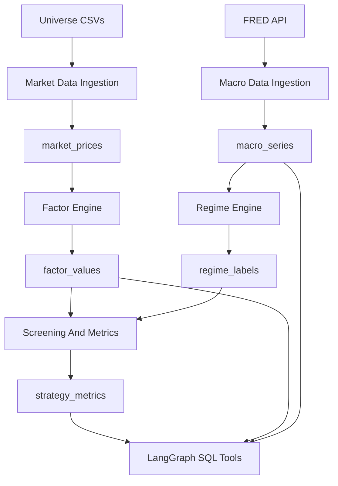
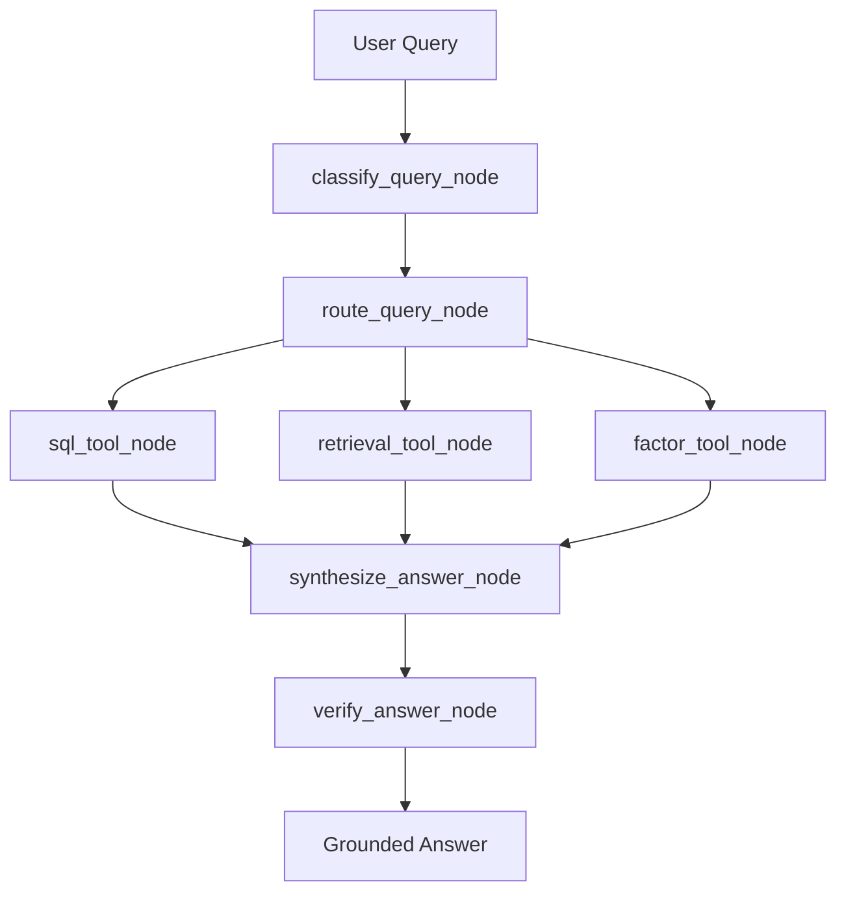

# Quant Analyst RAG Agent

## Project Overview

This project is a LangGraph-based financial research assistant that answers natural-language questions over structured SQL tables, factor documentation, backtest results, regime performance, anomaly logs, and research notes.

It is designed as an interview-ready engineering project, not a toy chatbot. The core idea is explicit routing: metric questions go to SQL tools, exact event/factor/date questions use BM25, semantic research questions use vector retrieval, and causal questions combine structured evidence with retrieved notes.

## Next Phase: Real Market Data Scope

The current implementation is a complete local sample-data version. The next phase should upgrade it into a real daily-market-data research assistant while preserving the same LangGraph, SQL-tool, retrieval, and verification architecture.

Target market coverage:

- US market: `QQQ` or `NQ=F` as Nasdaq exposure, `GLD`, `SPY`, `IWM`, and large-cap technology names such as `NVDA`, `MSFT`, `AAPL`, `AMZN`, `GOOGL`, `META`, `TSLA`, and `AVGO`.
- Hong Kong market: core liquid Hong Kong technology and index proxies such as `0700.HK`, `9988.HK`, `3690.HK`, `1810.HK`, and `2800.HK`.
- China A-share market: an A-share discovery universe focused on liquid stocks, initially from CSI 300, CSI 500, ChiNext, and STAR Market candidates.
- Frequency: daily OHLCV bars only.
- Time range: 2020 to present, covering COVID, inflation, rate hikes, and the AI bull market.
- Deployment target: local-first. CLI is required; Streamlit is recommended for portfolio presentation.
- Backtest depth: factor stratification, factor rankings, and strategy-level metrics rather than a full execution simulator.

Recommended data-source policy:

- Free first, with limited API keys accepted where useful.
- US equities, ETFs, indexes, and futures proxies: `yfinance` for `QQQ`, `GLD`, `SPY`, `IWM`, large-cap technology stocks, `^VIX`, `^IXIC`, and optionally `NQ=F`.
- Macro data: FRED with a free `FRED_API_KEY` for CPI, Fed Funds, Treasury yields, unemployment, yield curve spreads, and recession indicators.
- A-share data: start with `akshare` for no-key access; optionally add `tushare` later if a token is available.
- Hong Kong data: use `yfinance` `.HK` tickers first, with `akshare` as a fallback where coverage is weak.
- Universe metadata: keep curated CSV universe files first, then automate index membership later.

## Real Data Architecture Plan

The real-data extension should keep generated artifacts rebuildable and separate raw data from analytics outputs.

Recommended folders:

```text
src/quant_agent/
  data_sources/
    yahoo_client.py
    fred_client.py
    akshare_client.py
    baostock_client.py

  universe/
    symbols.py
    universe_us.csv
    universe_hk.csv
    universe_cn.csv

  pipelines/
    ingest_market_data.py
    ingest_macro_data.py
    compute_factors.py
    label_regimes.py
    build_real_db.py

  analytics/
    factor_engine.py
    regime_engine.py
    screening.py
    backtest_metrics.py

  streamlit_app/
    app.py
```

Recommended real-data tables:

- `market_prices`: normalized daily OHLCV for US, HK, and CN instruments.
- `macro_series`: FRED and other macro time series.
- `symbol_metadata`: ticker, exchange, country, sector, industry, currency, and data source.
- `factor_values`: computed daily factor values and cross-sectional ranks.
- `regime_labels`: daily market and macro regime labels.
- `factor_rankings`: latest factor screens by universe and date.
- `strategy_metrics`: factor stratification and strategy-level metrics.
- `ingestion_runs`: source, run time, status, row counts, and error messages.
- `data_quality_checks`: missing dates, duplicate rows, stale symbols, and invalid OHLCV checks.

The real-data pipeline should follow this flow:



## Real Data Factor And Screening Plan

Start with deterministic daily factors that are explainable in interviews:

- `momentum_20d`: 20-day price momentum.
- `momentum_60d`: 60-day price momentum.
- `volatility_20d`: annualized 20-day realized volatility.
- `dollar_volume_20d`: 20-day average traded dollar value.
- `trend_strength`: price relative to moving averages or rolling high/low location.
- `drawdown_60d`: current drawdown from the rolling 60-day high.
- `market_relative_strength`: instrument return minus benchmark return.

For A-share stock discovery, implement an initial deterministic screen:

```text
high liquidity
+ improving 60-day momentum
+ controlled 60-day drawdown
+ moderate realized volatility
+ positive market-relative strength
```

Backtest metrics should remain simple and reproducible:

- factor quantile returns
- top quantile vs bottom quantile
- annualized return
- Sharpe ratio
- max drawdown
- turnover
- hit rate
- regime breakdown

## Real Data Tooling Roadmap

The LangGraph architecture should be extended with new deterministic tools:

- `market_data_tool`: retrieve daily bars, returns, volatility, drawdown, and relative strength.
- `macro_tool`: retrieve CPI, Fed Funds, Treasury yields, VIX, yield curve, and related macro series.
- `screening_tool`: return A-share candidates based on factor screens.
- `factor_ranking_tool`: compare factor ranks across symbols, regions, and dates.
- `real_regime_tool`: classify or retrieve inflation, rate-hike, high-volatility, drawdown, recovery, and AI bull-market regimes.

Example real-data questions the next implementation should support:

- "Since 2023, did NVDA or QQQ have stronger 60-day momentum?"
- "Which A-share stocks currently have high liquidity, improving momentum, and controlled drawdown?"
- "How did GLD compare with QQQ during rate-hike regimes?"
- "During high-VIX regimes, were large-cap technology stocks or gold more defensive?"
- "Show the latest factor screen for liquid A-share candidates."

## Agent Handoff For Continued Build

Future coding agents should continue from this sequence:

1. Add `data_sources` clients for Yahoo Finance, FRED, and A-share/HK providers.
2. Add universe CSV files for US, HK, and CN symbols.
3. Add real-data database schema and a `build_real_db` pipeline.
4. Implement daily OHLCV and macro ingestion from 2020 to present.
5. Add data-quality validation for missing bars, duplicate rows, invalid prices, and stale data.
6. Compute daily factor values and regime labels.
7. Implement factor screens and simple factor-stratification metrics.
8. Add SQL tools for real market, macro, factor, screening, and regime tables.
9. Extend the deterministic router to send real-data questions to the new tools.
10. Update CLI commands for real-data ingestion, factor computation, and screens.
11. Add tests using small fixtures and mocked API responses.
12. Add an optional Streamlit app for portfolio presentation after CLI workflows are stable.

Important implementation constraints:

- Do not execute arbitrary LLM-generated SQL.
- Keep all numerical claims grounded in SQL rows or deterministic calculations.
- Record data source, ingestion time, and freshness status.
- Keep API keys in `.env` only; never commit secrets.
- Prefer incremental updates after the first full build.
- Keep the project local-first and reproducible.

## Why Pure Vector RAG Is Not Enough for Financial Research

Financial research questions often require exact numbers: Sharpe ratios, max drawdowns, turnover, date ranges, factor names, and regime labels. A generic vector retriever can find related prose, but it should not invent metrics or decide ranking logic. This project keeps numerical answers in SQLite and uses retrieval for explanations.

## Architecture



## Data Model

SQLite tables include `prices`, `factors`, `backtest_results`, `regime_performance`, `anomaly_logs`, and `factor_definitions`. Sample CSV data is stored in `data/raw` and can be rebuilt into `data/processed/quant_agent.db`.

## LangGraph Workflow

The graph classifies the query, maps it to a deterministic route, executes the relevant tools, synthesizes an answer, and verifies evidence. The implementation uses LangGraph when installed and includes a sequential fallback for local development.

## SQL Tools

The SQL layer exposes safe, parameterized functions only. It does not execute arbitrary LLM-generated SQL. Tool functions include best factor by regime, factor comparison, strategy metrics, factor definitions, regime comparison, anomaly lookup, and best-strategy ranking.

## BM25 + Vector Hybrid Retrieval

BM25 supports exact matching for dates, factor names, event names, and phrases. The local vector retriever uses deterministic TF-IDF cosine similarity for semantic note retrieval. The hybrid retriever combines normalized scores with a default alpha of 0.5.

## Answer Verification

The verifier enforces evidence requirements: SQL-only answers need SQL rows, retrieval answers need documents, and causal answers need retrieved evidence. If local evidence is missing, the agent refuses to answer confidently.

## Setup

```bash
cd RAG/quant-analyst-rag-agent
python3 -m venv .venv
source .venv/bin/activate
python3 -m pip install -e ".[dev]"
```

## Running The Demo

```bash
python3 -m quant_agent.cli.build_indexes --build-db --build-bm25 --build-vector
python3 -m quant_agent.cli.ask "Which factor performed best during high-volatility regimes?"
python3 -m quant_agent.cli.ask "What caused the momentum strategy to underperform in March 2020?"
```

## Example Questions and Outputs

See `examples/demo_queries.md` and `examples/sample_outputs.md`.

## Evaluation

```bash
python3 -m quant_agent.cli.run_eval --routing
python3 -m quant_agent.cli.run_eval --retrieval
python3 -m quant_agent.cli.run_eval --grounding
pytest
```

## Technical Trade-offs

SQLite keeps the project easy to run locally. The vector retriever is deterministic and local rather than API-backed. The router is deterministic first so the core behavior is testable; an LLM classifier can be added later as a second layer.

## Limitations

The data is realistic sample data, not live market data. Results are useful for demonstrating architecture and workflow design, but they are not investment advice and should not be presented as production backtest performance.

## Resume Bullets

- Built a LangGraph financial research agent that routes questions across SQLite tools, BM25 keyword search, local vector retrieval, and deterministic answer verification.
- Implemented safe parameterized SQL tools for backtest metrics, regime performance, factor definitions, anomaly logs, and strategy comparison.
- Added evaluation scripts for routing accuracy, retrieval quality, and answer grounding to reduce hallucinated financial claims.

## Interview Talking Points

Discuss why exact financial metrics belong in SQL, why BM25 helps with dates and factor names, why vector retrieval helps with research notes, and why LangGraph provides explicit state and tool orchestration.
