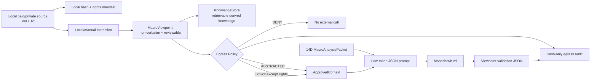

# Private Material Intelligence：付费订阅与私人宏观材料接入工程

## 1. 目标与边界

这个模块让 Kimi 参与优质宏观材料的研究过程，但不把 Kimi 当作原始资料库，也不把“学习”理解为训练模型参数。

系统中的知识积累发生在本地、可版本化的 `KnowledgeStore`：原始材料留在本地文件系统，人工或本地工具先把材料提炼成不可还原原文的 `MacroViewpoint`；Kimi 每次只读取经过 `Egress Policy` 批准的观点卡和 14D numeric packet，输出观点验证与可证伪的 pricing hypothesis。

首版解决四个问题：

1. 付费原文和私人内容不会因为 RAG ingestion 自动进入外部 LLM；
2. Kimi 仍能比较观点与真实宏观数据，识别支持、反证和未知项；
3. 每次外发都有不含原文的 hash audit；
4. 相同材料和观点重复运行不会产生重复知识记录或索引任务。

本模块不是版权或合规意见。`rights_scope` 必须依据实际订阅协议或材料提供者的授权填写；无法确认时使用最保守配置。

## 2. 核心原则：原文与派生知识分离



为什么这样做：

- RAG 可检索性与外部发送权限不是同一件事，必须使用不同的数据结构表达；
- 一旦把原文写入通用 `KnowledgeDocument.content`，后续 retriever 很容易在无意中把它拼进 prompt；
- hash、权限和观点可以支持复现与撤销，原文没有必要复制到另一个数据库；
- Kimi 的优势是跨证据比较与归纳，不需要为了发挥这些能力读取整篇原文。

## 3. 数据契约

### 3.1 `MaterialManifest`

`MaterialManifest` 是原始材料的 control plane，只保存：

- `material_id`：稳定身份；
- `local_path`：本地来源位置；
- `source_hash`：SHA-256，用于去重与变更检测；
- `sensitivity`：材料敏感级别；
- `rights_scope`：个人研究、内部研究或允许外部处理；
- `external_context_mode`：外发模式；
- `max_external_chars`：单次字符预算；
- `redaction_required`：是否进行 secret/PII redaction；
- `license_expires_on`：授权有效期；
- `as_of/created_at/updated_at`：时间和审计语义。

它没有 `raw_text`、`raw_content` 或 blob 字段。SQLite 中的 `private_material_manifests` 只保存 manifest JSON 和查询字段。

### 3.2 `MacroViewpoint`

`MacroViewpoint` 是从材料本地提炼出的派生知识：

```json
{
  "viewpoint_id": "mv/private-demo/treasury-supply",
  "topic": "FISCAL_OR_TREASURY_SUPPLY",
  "claim": "Long-end rate pressure may reflect financing supply and weak duration absorption.",
  "horizon": "2W_3M",
  "evidence_summary": ["Term-premium pressure is the proposed channel."],
  "market_implications": ["TREASURY_20Y_PLUS_REJECTION"],
  "invalidation_conditions": ["Duration absorption improves as real yields and USD weaken."],
  "confidence": 0.62,
  "source_disclosure": "licensed material, locally abstracted",
  "verbatim_text_included": false,
  "status": "APPROVED",
  "approved_for_external": true
}
```

只有同时满足以下条件的观点才能通过 abstracted egress：

- `status == APPROVED`；
- `approved_for_external == true`；
- `verbatim_text_included == false`；
- `material_id` 与 manifest 一致；
- 授权尚未过期。

### 3.3 `EgressDecision`

`EgressDecision` 是 Kimi 调用的强制门票，包含批准后的 `ApprovedContext`、reason codes、字符数和 context hash。调用代码不能直接接受 `MaterialManifest.local_path` 或原始文件内容。

这相当于在应用层实现一个 data loss prevention boundary：provider client 只接收 gate 的输出，而不是接收任意 retriever 文本。

## 4. 权限状态机

| Mode | Kimi 可见内容 | 使用条件 | 默认用途 |
| --- | --- | --- | --- |
| `DENY` | 无 | 材料禁止外发、权限未知或希望完全本地 | 私密聊天、客户资料、无法确认授权的材料 |
| `ABSTRACTED_CLAIMS_ONLY` | 人工批准的观点 JSON，不含原文 | `APPROVED + non-verbatim` | 付费订阅和私人研究的默认模式 |
| `ALLOWLISTED_EXCERPTS` | 观点卡 + 本地精确校验的短摘录 | `EXTERNAL_PROCESSING_ALLOWED` | 协议明确允许第三方 AI 处理时 |

`ALLOWLISTED_EXCERPTS` 不接受命令行中的任意字符串作为可信摘录。策略函数要求 excerpt 必须是本地原文的精确子串，然后执行字符预算和 redaction。首版最多发送 3 个 contexts。

## 5. 完整执行链路

### Step 1：本地准备材料

真实材料建议放在：

```text
data/private/materials/
```

该目录已加入 `.gitignore`。首版只支持 `.md` 和 `.txt`，因为它们的文本边界清晰；PDF、邮件和图片 OCR 应作为后续 adapter，在本地转换完成后再进入同一流程。

### Step 2：填写 manifest

复制 fixture 结构并填写真实权限。无法确认授权时：

```json
{
  "sensitivity": "LICENSED_LOCAL_ONLY",
  "rights_scope": "PERSONAL_RESEARCH_ONLY",
  "external_context_mode": "ABSTRACTED_CLAIMS_ONLY",
  "max_external_chars": 3000,
  "redaction_required": true
}
```

如果材料提供者明确要求不得经过任何外部模型，设置：

```json
{
  "external_context_mode": "DENY",
  "max_external_chars": 0
}
```

### Step 3：本地形成观点卡

首版采用 human-in-the-loop：阅读材料后填写 viewpoint JSON。这样可以先验证最重要的权限边界和分析闭环，不急于引入另一个本地模型。

后续可以增加 Ollama/llama.cpp adapter 在本地生成 `DRAFT`，但仍必须由人把状态改为 `APPROVED` 才能进入 Kimi。

### Step 4：发布派生知识

`viewpoint_to_knowledge_bundle()` 会生成：

- `KnowledgeDocumentType.MACRO_VIEWPOINT`；
- `VIEWPOINT` chunk；
- `EVIDENCE` chunk；
- `INVALIDATION` chunk。

文档 metadata 明确记录 `raw_source_included=false`。原始文件不会进入 `KnowledgeStore`，因此普通 BM25/vector retrieval 只能命中观点卡。

### Step 5：Egress Policy

`evaluate_egress()` 检查状态、权限、到期日、人工批准、verbatim 标记、字符预算和 secret/PII。失败返回 `allowed=false` 和稳定 reason codes，不构建 prompt。

### Step 6：Kimi 验证

Kimi 输入由两部分组成：

1. deterministic 14D `MacroAnalysisPacket`；
2. 最多 3 条 `ApprovedContext`。

输出只允许 JSON，包含：

- `viewpoint_assessments`：`SUPPORTED / CONTRADICTED / MIXED / INSUFFICIENT_EVIDENCE`；
- supporting 与 contradicting numeric evidence；
- dominant pricing hypothesis；
- cross-source consensus/conflicts；
- unknowns 与 invalidation watch。

Prompt 明确禁止复述原始材料、投资建议和未来价格预测。

### Step 7：Cache 与 Audit

cache key 由 `numeric_packet + context_hash + model + prompt_version` 生成。同样的数值窗口和观点不重复调用 Kimi。

`.cache/private_material_kimi/` 只保存派生 JSON response，不保存 approved contexts；目录和文件尽量设置为 `0700/0600`。

`llm_egress_audit` 只记录：

```text
decision_id / purpose / provider / model / outcome
context_mode / material_ids / viewpoint_ids / reason_codes
characters_sent / context_hash / response_hash / error_type / created_at
```

表中没有 prompt、context text 或 response payload 字段。

## 6. 代码地图

```text
src/domain/private_material.py
  权限、manifest、viewpoint、approved context、egress decision 契约

src/quant_agent/private_materials/ingestion.py
  本地文件 hash、manifest/viewpoint JSON loader

src/quant_agent/private_materials/policy.py
  唯一 external egress gate、allowlist 校验、redaction、字符预算

src/quant_agent/private_materials/store.py
  manifest/viewpoint/hash-only audit SQLite store

src/quant_agent/private_materials/knowledge.py
  MacroViewpoint -> canonical KnowledgeDocument/KnowledgeChunk

src/quant_agent/private_materials/analysis.py
  Kimi JSON prompt/schema validation、cache key、derived-response cache

src/quant_agent/cli/run_private_material_intelligence.py
  可重复运行的 end-to-end CLI

tests/test_private_materials.py
  privacy boundary、rights、allowlist、幂等、prompt 与 audit 测试
```

## 7. 运行方式

### 完全离线 dry-run

```bash
PYTHONPATH=src .venv/bin/python -m quant_agent.cli.run_private_material_intelligence \
  --source tests/fixtures/private_materials/synthetic_paid_note.md \
  --manifest tests/fixtures/private_materials/manifest.json \
  --viewpoint tests/fixtures/private_materials/viewpoint.json \
  --numeric-packet outputs/macro/macro_analysis_packet_2026-07-15.json \
  --db /tmp/private_material_demo.db
```

输出只显示 ID、hash、字符数、policy status、audit ID 和 ingestion status，不显示原文、prompt、Kimi response 或 API Key。

### 启用 Kimi

先在当前 shell 中确认环境变量是否存在，严禁输出具体值：

```bash
.venv/bin/python -c 'import os; print(bool(os.getenv("MOONSHOT_API_KEY")))'
```

然后在同一条命令增加：

```text
--with-kimi
```

API Key 仅由 `KimiConfig.from_env()` 通过 `os.getenv("MOONSHOT_API_KEY")` 获取。

### 测试

```bash
.venv/bin/python -m pytest -q tests/test_private_materials.py
.venv/bin/python -m pytest -q
```

## 8. 为什么不让 Kimi 直接总结全文

直接把全文交给模型看似简单，但会混合四种不同职责：source acquisition、rights decision、knowledge extraction 和 market inference。一旦权限发生变化，也很难知道哪些 cache、embedding 和 research note 需要撤销。

当前设计把它们拆开：

- 原文是本地 source asset；
- manifest 决定能做什么；
- viewpoint 是可以版本化、检索和撤销的研究知识；
- numeric packet 是事实证据；
- Kimi inference 是带 packet/context hash 的派生结果。

这使系统能够回答：Kimi 当时看到了什么级别的信息、为什么允许发送、用的是哪一版宏观数据、结论在哪些条件下失效。

## 9. 当前限制与下一阶段

MVP 有意保留以下限制：

- 只支持 `.md/.txt`，尚未实现 PDF/OCR/email adapter；
- viewpoint 目前由人填写，尚未接本地 LLM draft extraction；
- redaction 只有基础 secret/email/phone patterns，不能替代专业 DLP；
- SQLite 不保存原文，也没有承担原文件 encryption at rest；磁盘安全依赖操作系统权限/FileVault；
- 暂未实现 license expiry 后自动 retract 已发布 viewpoint；
- Kimi 分析结果目前进入 cache/audit，下一步再转成有生命周期的 `KnowledgeDocument`，避免未经复核的模型 inference 自动污染知识库。

建议下一阶段按顺序实现：

1. PDF/local OCR adapter；
2. local LLM 生成 `DRAFT MacroViewpoint`；
3. review/approve CLI；
4. license expiry/revocation job；
5. 多观点 consensus graph；
6. 经人工确认的 Kimi inference ingestion。

## 10. 面试表达

可以把这个模块概括为：

> I separated retrieval eligibility from external-LLM egress rights. Licensed source files remain local and are represented by hash-only manifests. The RAG store receives only human-approved, non-verbatim macro viewpoints. Before any Kimi call, a deterministic egress policy checks rights, expiry, approval status, redaction and a character budget. The model then validates those viewpoints against a point-in-time 14-day macro packet. Audit records keep only identities, counts and hashes, so the system is reproducible without persisting private prompts.

核心工程点不是“接了一个大模型”，而是用 data contract、policy gate、provenance、idempotency、cache 和 audit 把第三方模型变成受控的推理组件。
