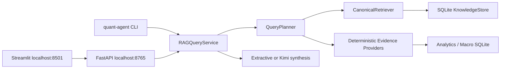

# Unified RAG Query Service 与 Local Web UI 实施计划

- 状态：Phase A implemented；Phase B（semantic/RRF/API/UI）proposed
- 目标版本：RAG Query Service v1
- 默认运行方式：local-only，绑定 `127.0.0.1`
- 核心数据库：SQLite canonical KnowledgeStore
- UI：Streamlit
- API：FastAPI
- LLM：可选 Moonshot/Kimi；无 Key 时必须完整支持 search-only

## 1. 为什么要做这一阶段

当前项目已经有两套彼此分离的知识链路：

1. 旧链路从 `data/docs/*.md` 读取文本，构建 pickle BM25/TF-IDF index，供 `RetrievalTool` 和旧 `ask` 使用；
2. 新链路把版本化 `KnowledgeDocument/KnowledgeChunk` 写入 SQLite，具备 `available_at`、status、reliability、outbox 和 private-material boundary，但没有统一 search/query service。

这造成几个实际问题：

- 新生成的宏观研究笔记已经在 KnowledgeStore 中，但旧 `ask` 不会检索它；
- 旧 tokenizer 只匹配 `[a-z0-9_]`，中文查询几乎没有 lexical recall；
- 旧 vector retriever 实际是 TF-IDF cosine，并非语义 embedding；
- SQLite `knowledge_index_jobs` 已经存在，却没有 worker 消费；
- graph 的 synthesis 是针对 demo 问题硬编码的，不能回答一般研究问题；
- 用户必须记住多个 CLI，缺乏统一产品入口；
- UI 如果直接读 SQLite，会绕过 point-in-time、private policy 和 evidence contract。

这一阶段的目标不是“加一个聊天框”，而是建立统一的 research application boundary：

```text
CLI / Web UI / Future automation
              ↓
        RAG Query Service
              ↓
Query planning → deterministic tools → canonical retrieval → grounded synthesis
              ↓
KnowledgeStore / Analytics DB / Macro DB
```

## 2. 目标与非目标

### 2.1 目标

完成后用户可以运行：

```bash
quant-agent serve
```

然后在本地浏览器中：

- 输入中文或英文研究问题；
- 选择 `as_of`、主题、股票、文档类型和是否调用 Kimi；
- 查看回答、证据 chunks、原始数值、时间语义和风险提示；
- 浏览 KnowledgeDocument 生命周期；
- 查看 index lag、数据新鲜度与 Kimi 是否配置；
- 上传 private material、查看 DRAFT viewpoint，但未经批准不进入 external context；
- 运行宏观更新和 A 股筛选，并从同一界面查看产出。

### 2.2 非目标

首版不做：

- 公网部署、多用户账户和远程访问；
- 实盘交易和券商下单；
- 任意自然语言 SQL；
- 让 LLM 自动修改数据或批准 private material；
- 自动把 Kimi inference 当成事实写入知识库；
- 大规模分布式向量数据库；
- React 前端和复杂权限系统。

## 3. 关键设计决策

### 3.1 Query core、API 与 UI 三层分离



为什么：

- CLI 和 Web 共享同一套业务规则；
- UI 不直接访问 SQLite，防止绕过权限和 point-in-time filter；
- Query core 可以在 pytest 中完全离线测试；
- 将来更换 UI 不影响检索与数据契约；
- FastAPI contract 可以提供给未来 automation 或 notebook。

### 3.2 FastAPI + Streamlit

选择 FastAPI 作为 service adapter，Streamlit 作为本地 UI：

- FastAPI 负责 typed request/response、health check 和稳定 API；
- Streamlit 适合研究表格、图表、evidence cards 和本地文件上传；
- 首版无需前端构建工具；
- 未来需要更强交互时可以替换 UI，API 保持不变。

### 3.3 两个数据库角色保持分离

当前项目存在：

```text
data/processed/quant_agent.db          # demo/analytics tables
data/processed/phase1_research.db      # Phase1、macro、KnowledgeStore、private material
```

首版不做危险的全库迁移，而是显式配置：

```text
ANALYTICS_DB_PATH=data/processed/quant_agent.db
KNOWLEDGE_DB_PATH=data/processed/phase1_research.db
```

`RAGQueryService` 同时持有：

- `KnowledgeRepository`：文档与文本证据；
- `AnalyticsEvidenceProvider`：回测、因子和筛选；
- `MacroEvidenceProvider`：宏观 snapshot/history/change event。

后续可以决定是否通过 SQLite `ATTACH DATABASE` 合并查询视图，但不作为 MVP 前置条件。

### 3.4 默认 local-only

- API 绑定 `127.0.0.1`，不绑定 `0.0.0.0`；
- Streamlit 只访问 localhost API；
- CORS allowlist 只包含 localhost；
- API Key 只存在 backend process environment；
- 浏览器永远看不到 Key；
- health endpoint 只返回 `kimi_configured: true/false`；
- 不记录完整 prompt 或 private source content。

## 4. Query Contract

新增 `src/domain/query.py`。

### 4.1 `RAGQueryRequest`

```python
@dataclass(frozen=True, slots=True)
class RAGQueryRequest:
    query_text: str
    as_of: datetime
    mode: QueryMode
    tickers: tuple[str, ...] = ()
    themes: tuple[str, ...] = ()
    document_types: tuple[KnowledgeDocumentType, ...] = ()
    reliability: tuple[KnowledgeReliability, ...] = ()
    event_time_from: datetime | None = None
    event_time_to: datetime | None = None
    top_k: int = 8
    use_llm: bool = False
    include_numeric_evidence: bool = True
```

`QueryMode`：

```text
SEARCH_ONLY
ANSWER
CAUSAL_RESEARCH
MACRO_RESEARCH
CN_EQUITY_RESEARCH
```

关键约束：

- `as_of` 必填且 timezone-aware；
- 默认 status 只允许 `FINALIZED`；
- Web UI 不提供“检索 RETRACTED”选项；
- `DRAFT` 只能在独立 review 页面查看，不能进入普通 query；
- `use_llm=False` 时仍必须返回完整 evidence response。

### 4.2 `RetrievedEvidence`

```python
@dataclass(frozen=True, slots=True)
class RetrievedEvidence:
    evidence_id: str
    document_id: str
    document_version: int
    chunk_id: str
    document_type: str
    title: str
    section: str
    text: str
    source_uri: str | None
    event_time: datetime | None
    available_at: datetime
    reliability: str
    lexical_score: float
    semantic_score: float
    fusion_score: float
    reason_codes: tuple[str, ...]
```

回答只能引用 response 中存在的 `evidence_id/chunk_id`。

### 4.3 `NumericEvidence`

```python
@dataclass(frozen=True, slots=True)
class NumericEvidence:
    evidence_id: str
    provider: str
    metric: str
    value: JsonValue
    unit: str | None
    observation_time: datetime | None
    available_at: datetime
    source_table: str
    query_version: str
```

这样可以强制区分：

- 文档观点；
- 结构化市场事实；
- 模型推断。

### 4.4 `RAGQueryResponse`

```python
@dataclass(frozen=True, slots=True)
class RAGQueryResponse:
    query_id: str
    route: str
    answer_markdown: str
    confidence: str
    document_evidence: tuple[RetrievedEvidence, ...]
    numeric_evidence: tuple[NumericEvidence, ...]
    citations: tuple[str, ...]
    warnings: tuple[str, ...]
    data_as_of: datetime
    llm_used: bool
    model: str | None
    timings_ms: dict[str, float]
```

## 5. Canonical Retrieval

### 5.1 One-time Markdown migration

旧 `data/docs/*.md` 先通过 `ingest_markdown_corpus` 转为 canonical documents：

```text
Markdown source
→ stable document_id based on relative path
→ semantic section chunks
→ KnowledgeStore.ingest
→ knowledge_index_jobs
```

旧 Markdown 仍作为 source asset 保留，但 query 不再直接扫描目录。

### 5.2 Index schema

在 KnowledgeStore SQLite 中新增：

```text
knowledge_lexical_index        # SQLite FTS5
knowledge_embeddings           # local embedding vectors + model/version/hash
knowledge_index_state          # worker watermark/model/index version
query_runs                     # hash/route/timing/status, no prompt
query_evidence_links           # query_id → evidence ids
```

推荐字段：

```text
chunk_id
document_id
document_version
content_hash
title
section
text
embedding_model
embedding_dimension
embedding_blob
indexed_at
```

### 5.3 中文 lexical retrieval

现有 tokenizer 必须替换，因为它不识别中文。

MVP 方案：

- English：单词、数字、ticker、snake_case；
- Chinese：汉字 unigram + bigram；
- finance aliases：`韩国央行/BOK/Bank of Korea`、`实际利率/real yield` 等；
- ticker/theme tokens 保留原样；
- SQLite FTS5 作为持久 lexical index；若本机 trigram tokenizer 不可用，使用应用层 CJK bigram fallback。

不要让 jieba dictionary 成为系统唯一依赖；金融新词和股票代码必须通过 deterministic tokens 保留。

### 5.4 Local semantic embeddings

定义 provider protocol：

```python
class EmbeddingProvider(Protocol):
    model_name: str
    dimension: int
    def embed_documents(self, texts: list[str]) -> list[list[float]]: ...
    def embed_query(self, text: str) -> list[float]: ...
```

首版提供：

1. `DeterministicHashEmbedding`：fixture/offline tests；
2. `SentenceTransformerEmbedding`：本地 multilingual model；
3. 无本地模型时降级为 lexical-only，不调用外部 embedding API。

推荐较小的中英双语本地模型，模型下载和版本必须显式，不在每次启动时偷偷下载。

### 5.5 Outbox index worker

实现 `KnowledgeIndexWorker`：

```text
claim_index_jobs
→ validate latest document/chunk/content_hash
→ UPSERT lexical row
→ calculate/reuse embedding
→ UPSERT embedding row
→ complete job
```

DELETE job：

```text
delete lexical row
delete embedding row
complete job
```

Failure semantics：

- at-least-once delivery；
- `chunk_id + version + content_hash + model` 唯一；
- crash after index write 可以安全 retry；
- embedding failure 不删除旧 index；
- worker failure 不污染 KnowledgeDocument；
- health endpoint 报告 pending/failed/index lag；
- UI 可以手动 retry failed job，但不能修改文档内容。

### 5.6 Retrieval flow

```text
RAGQueryRequest
→ canonical metadata/time/status filters
→ lexical top 50
→ semantic top 50
→ join only eligible chunk identities
→ Reciprocal Rank Fusion
→ reliability/recency reason codes
→ diversity dedup by document/section
→ top_k evidence
```

融合使用 RRF，而不是当前按最大值归一化：

```text
rrf_score = 1 / (k + lexical_rank) + 1 / (k + semantic_rank)
```

原因：不同 retriever 的 raw score 不可直接比较，RRF 对 score calibration 更稳健。

时间和权限 filter 必须发生在最终返回之前；semantic similarity 不能越过 `available_at`、status 或 `indexable`。

## 6. Query Planning 与 Deterministic Tools

### 6.1 替换英文 keyword-only router

新增 `QueryPlanner`，首版仍保持 deterministic：

- 中英文 intent aliases；
- ticker、日期、theme、market、metric extraction；
- 用户 UI filter 优先于文本推断；
- 无法判断时返回 clarification，而不是猜测。

Route：

| Route | Providers |
| --- | --- |
| `DOCUMENT_RESEARCH` | CanonicalRetriever |
| `MACRO_STATE` | MacroEvidenceProvider + Retriever |
| `CN_EQUITY_SCREEN` | ScreeningEvidenceProvider + Retriever |
| `THESIS_LIFECYCLE` | Thesis provider + Retriever |
| `CAUSAL_RESEARCH` | Numeric providers + Retriever + counterfactual template |
| `SYSTEM_STATUS` | Health service |

### 6.2 Evidence providers

```python
class EvidenceProvider(Protocol):
    name: str
    def supports(self, plan: QueryPlan) -> bool: ...
    def fetch(self, plan: QueryPlan) -> list[NumericEvidence]: ...
```

首版实现：

- `MacroEvidenceProvider`：snapshot、14D history、change events；
- `ScreeningEvidenceProvider`：WaveScore、reversal screen、exclusion reasons；
- `ThesisEvidenceProvider`：thesis state transitions；
- `KnowledgeEvidenceProvider`：canonical chunks；
- 旧 demo SQL provider 作为 compatibility adapter。

禁止 LLM 生成任意 SQL。每个 provider 使用固定、参数化 repository method。

## 7. Answer Synthesis

### 7.1 两种模式

#### Extractive mode

不需要 Kimi：

- 返回 top evidence；
- 用模板组织事实、观点、冲突和不足；
- 适合 system offline、private policy deny 或无 Key。

#### Kimi grounded mode

只有用户显式打开 `Use Kimi` 才调用：

- 最多 6 个 document chunks；
- numeric evidence 原样传入；
- 总 context character/token budget；
- temperature 0；
- JSON output；
- 强制引用 `evidence_id`；
- 禁止投资建议和价格预测；
- provider failure 自动降级 extractive response。

### 7.2 Citation validation

Kimi output schema：

```json
{
  "answer": "...",
  "claims": [
    {
      "claim": "...",
      "evidence_ids": ["chunk/...", "metric/..."]
    }
  ],
  "contradictions": [],
  "unknowns": [],
  "confidence": "medium"
}
```

`CitationValidator` 检查：

- 每个 evidence ID 必须在本次 request context 中；
- 事实性 claim 没有 citation 时降级或拒绝；
- answer 不得引用 private raw source；
- 数值必须能在 `NumericEvidence` 中精确找到；
- validation 失败时返回 evidence-only response，而不是不可靠答案。

## 8. Private Material Boundary

### 8.1 普通查询

- `private_material_manifests` 不属于 searchable corpus；
- 原始文件路径不进入 prompt；
- DRAFT viewpoint chunk `indexable=false`；
- 只有 `FINALIZED`、non-verbatim derived viewpoint 可以被普通 retriever 返回；
- source URI 只显示 `private-material://material_id`，不显示本地绝对路径。

### 8.2 Review UI

Private Inbox 页面是管理界面，不是普通 query：

```text
Upload local file
→ default LICENSED_LOCAL_ONLY
→ local hash
→ DRAFT viewpoint
→ human review
→ approve/reject
```

批准动作必须二次确认，并显示：

- Kimi 能看到哪些抽象字段；
- 发送字符数；
- 是否包含 verbatim excerpt；
- rights mode 和 license expiry。

UI 不能自动把 `ALLOWLISTED_EXCERPTS` 打开；只有用户明确修改权限后才可用。

## 9. FastAPI

建议 endpoints：

```text
GET  /api/health
GET  /api/system/status
POST /api/search
POST /api/query
GET  /api/query/{query_id}
GET  /api/documents
GET  /api/documents/{document_id}
GET  /api/documents/{document_id}/versions
POST /api/index/sync
POST /api/index/retry/{job_id}
GET  /api/macro/latest
GET  /api/screen/latest
GET  /api/private/materials
POST /api/private/import
POST /api/private/viewpoints/{viewpoint_id}/approve
```

MVP 第一批只开放：

```text
/health
/system/status
/search
/query
/documents
/documents/{id}
/index/sync
```

private write endpoints 放到第二批，先使用现有 CLI，降低首版风险。

## 10. Streamlit Local Web UI

### 10.1 Research 页面

布局：

```text
┌ Sidebar ──────────────────┐ ┌ Main ──────────────────────────────┐
│ as_of                    │ │ Research question                  │
│ mode                     │ │ [________________________________] │
│ themes / tickers         │ │ [Search only] [Use Kimi]          │
│ document types           │ │                                   │
│ top_k                    │ │ Answer / conclusion               │
│ use Kimi                 │ │                                   │
│ data freshness           │ │ Evidence cards                    │
└──────────────────────────┘ │ Numeric evidence / contradictions  │
                             └─────────────────────────────────────┘
```

每个 evidence card 显示：

- title、section、document type；
- event time、available_at、reliability；
- lexical/semantic/fusion score；
- source URI；
- exact retrieved chunk；
- “为什么召回” reason codes。

### 10.2 Knowledge Explorer

- 按 document type/status/theme/ticker 搜索；
- 查看版本历史；
- 查看 chunks 和 index status；
- 显示 superseded/retracted，但默认不参与检索；
- 不展示 private raw content。

### 10.3 Macro 页面

- 当前 liquidity/risk/rate-pressure state；
- 14D trend；
- change events；
- target absorption；
- 已发布 macro research notes；
- Kimi hypothesis 与 deterministic evidence 分栏显示。

### 10.4 A股页面

- 最新 WaveScore / reversal candidates；
- 可交易性和 exclusion reasons；
- ticker drill-down；
- thesis lifecycle；
- 对应 KnowledgeDocument evidence。

### 10.5 System 页面

- databases found；
- latest data as-of；
- knowledge document/chunk count；
- pending/failed index jobs；
- embedding model/index version；
- Kimi configured boolean；
- data source latest successful run；
- 一键执行 safe index sync。

## 11. Unified CLI

在 `pyproject.toml` 增加：

```toml
[project.scripts]
quant-agent = "quant_agent.cli.main:main"
```

目标命令：

```bash
quant-agent serve
quant-agent search "韩国加息 半导体"
quant-agent ask "韩国加息是否导致亚洲半导体下跌？"
quant-agent index sync
quant-agent index status
quant-agent macro run --live --history-days 14
quant-agent screen cn-wave --as-of 2026-07-17
quant-agent private import /path/to/file
```

`quant-agent serve`：

1. 检查数据库和 index schema；
2. 启动 FastAPI `127.0.0.1:8765`；
3. 启动 Streamlit `127.0.0.1:8501`；
4. 打开默认浏览器；
5. Ctrl+C 时正确关闭两个子进程。

## 12. 目标代码结构

```text
src/domain/
├── query.py
└── knowledge.py

src/quant_agent/query/
├── service.py
├── planner.py
├── contracts.py
├── synthesis.py
├── citations.py
├── cache.py
└── observability.py

src/quant_agent/retrieval/
├── canonical.py
├── lexical.py
├── embeddings.py
├── fusion.py
├── index_worker.py
└── markdown_migration.py

src/quant_agent/evidence/
├── base.py
├── macro.py
├── screening.py
├── thesis.py
└── legacy_analytics.py

src/quant_agent/api/
├── app.py
├── dependencies.py
├── schemas.py
└── routes/
    ├── query.py
    ├── documents.py
    ├── system.py
    └── index.py

src/quant_agent/web/
├── Home.py
├── api_client.py
└── pages/
    ├── 1_Research.py
    ├── 2_Knowledge_Explorer.py
    ├── 3_Macro.py
    ├── 4_A_Share.py
    └── 5_System.py

src/quant_agent/cli/
├── main.py
└── serve.py
```

## 13. Migration Strategy

不直接删除旧 retriever。

### Step 1：Canonical indexing

- 增加 schema 和 worker；
- 迁移 `data/docs`；
- 新旧 retriever 并存。

### Step 2：Dual-read evaluation

环境变量：

```text
RAG_RETRIEVER_MODE=legacy
RAG_RETRIEVER_MODE=canonical
RAG_RETRIEVER_MODE=compare
```

`compare` 同时运行两套检索，只记录排名差异，不重复调用 Kimi。

### Step 3：Switch query service

- FastAPI/Streamlit 只使用 canonical；
- CLI `ask` 改用 `RAGQueryService`；
- graph retrieval node 变成 service adapter；
- 保持旧 tests 直到新 evaluation 达标。

### Step 4：Deprecate legacy indexes

- `document_loader.py` 仅保留 migration/fixture；
- pickle index 不再是 runtime dependency；
- 删除必须单独 ADR，不在本阶段直接删除。

## 14. Tests

### 14.1 Unit

- 中文/英文 tokenizer；
- RRF；
- query planner；
- point-in-time filters；
- citation validation；
- private status policy；
- cache key；
- API schema validation。

### 14.2 Integration

- KnowledgeDocument ingestion → outbox → worker → search；
- rerun worker 不重复 embedding/index row；
- superseded/retracted document 从 search 消失；
- failed embedding job 不污染旧 index；
- future `available_at` document 不可见；
- Kimi failure 自动降级；
- API restart 后结果可复现。

### 14.3 Required regression queries

```text
韩国加息是否导致亚洲半导体下跌？
资金价格和系统流动性有什么区别？
What caused momentum to underperform in March 2020?
中际旭创为什么进入主升浪候选？
当前14日流动性主要流向了哪些资产？
```

第一条必须把刚发布的文档：

```text
macro-research/2026-07-17/korea-rate-asia-semiconductor
```

排在 top 3，且不能召回 private raw source。

### 14.4 API

- `/health` 不泄露 Key；
- `/search` 返回 typed evidence；
- `/query` 无 Key 可运行；
- invalid as_of 返回 422；
- private DRAFT 不可搜索；
- output citation IDs 全部可解析。

### 14.5 UI

- 页面能启动；
- API unavailable 显示可操作错误；
- evidence expander 正确显示；
- Kimi toggle 默认关闭；
- private source path 不出现在普通页面；
- system page 只显示 Key boolean。

## 15. Observability

每次 query 生成 `query_id`，记录：

```text
query_hash
mode / route
as_of
filters hash
retrieved chunk ids
numeric evidence ids
lexical / semantic / fusion latency
LLM called / cache hit / token usage
status / error_type
created_at
```

默认不写：

- API Key；
- complete prompt；
- private raw content；
- complete provider response。

UI System 页展示：

- p50/p95 query latency；
- no-result rate；
- citation validation failure；
- index backlog；
- Kimi cache hit rate。

## 16. Implementation Phases

### Phase A：Contract 与 canonical lexical vertical slice

工作：

- `RAGQueryRequest/Response`；
- Markdown migration；
- FTS/CJK lexical index；
- index worker；
- search-only service；
- CLI `quant-agent search`。

完成定义：

- 中文查询召回韩国加息研究 note top 3；
- private DRAFT 不可见；
- 新文档增量入库后无需 full rebuild；
- 重复 sync 不产生重复行。

### Phase B：Semantic retrieval 与 evidence providers

工作：

- local embedding provider；
- embedding table/cache；
- RRF；
- Macro/Screening/Thesis evidence providers；
- deterministic query planner。

完成定义：

- lexical-only 与 hybrid evaluation 可比较；
- 五条 regression queries 达到预设 recall；
- numeric evidence 带 point-in-time provenance。

### Phase C：Grounded answer service

工作：

- extractive synthesis；
- optional Kimi synthesis；
- citation validator；
- answer/cache/audit；
- CLI `quant-agent ask`。

完成定义：

- 无 Key 可以完整回答 evidence-first response；
- Kimi 只引用本次 evidence IDs；
- provider 失败安全降级；
- prompt/log 不含 private raw source 或 Key。

### Phase D：FastAPI

工作：

- `/health`、`/status`、`/search`、`/query`、`/documents`、`/index/sync`；
- typed Pydantic schemas；
- query run persistence；
- localhost security。

完成定义：

- TestClient 全部通过；
- API restart 可复现；
- 错误响应不泄露上下文或 secret。

### Phase E：Streamlit Web UI

工作：

- Research、Knowledge Explorer、Macro、A股、System 页面；
- evidence cards；
- data freshness；
- one-command launcher。

完成定义：

- `quant-agent serve` 后只需浏览器操作；
- 用户不需要记路径或 Python module 名；
- 能完成 search、answer、evidence inspection 和 system health。

### Phase F：Private Inbox Web workflow

工作：

- 本地上传；
- 自动 manifest；
- DRAFT viewpoint review；
- explicit approval；
- egress preview；
- audit viewer。

完成定义：

- 默认上传不会调用 Kimi；
- 原文不进入 KnowledgeStore；
- approval 前普通 query 无法检索；
- UI 展示发送给 Kimi 的准确字符数与字段。

## 17. 整体完成定义

这一项工程完成时必须满足：

1. `quant-agent serve` 一条命令启动 API 和 UI；
2. 中文研究问题可以召回 SQLite KnowledgeStore 中的真实研究文档；
3. 新文档通过 outbox 增量进入 index，不需要重建全部 pickle；
4. `available_at`、status、version、reliability 和 private policy 在 search 前生效；
5. search-only 不依赖 Kimi；
6. Kimi 是显式 opt-in，并只能读取批准后的 evidence packet；
7. 回答中的每个 citation 可以追溯到 chunk 或 numeric evidence；
8. UI 显示数据截至时间、来源、conflicts 和 unknowns；
9. 断网 fixture 测试可复现；
10. 重复启动、重复 index sync 和重复 query cache 不产生脏数据。

## 18. 面试讲法

可以这样概括：

> The original prototype had a file-based retriever and a separate canonical SQLite knowledge lifecycle. I unified them behind a typed RAG query service. The service applies point-in-time and authorization filters before retrieval, consumes transactional outbox jobs for incremental lexical and local semantic indexes, and fuses results with reciprocal rank fusion. Numeric evidence comes from deterministic domain providers rather than LLM-generated SQL. Both the CLI and local web UI use the same service contract. Kimi is optional and receives only an approved evidence packet; every generated claim must cite a retrieved chunk or numeric observation.

这里最重要的工程故事不是 Streamlit，而是：

- 如何迁移双轨知识系统；
- 如何保证 point-in-time 和 private boundary；
- 如何用 outbox 保护增量 index；
- 如何让检索、数值证据和生成式解释各自承担正确职责；
- 如何让 UI 不绕过 domain contract。
