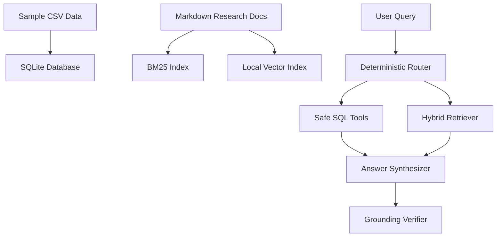

# Architecture

```mermaid
flowchart TD
    DataCsv[Sample CSV Data] --> SQLite[SQLite Database]
    MarkdownDocs[Markdown Research Docs] --> BM25[BM25 Index]
    MarkdownDocs --> Vector[Local Vector Index]
    Query[User Query] --> Router[Deterministic Router]
    Router --> SQLTools[Safe SQL Tools]
    Router --> Retrieval[Hybrid Retriever]
    SQLTools --> Synthesizer[Answer Synthesizer]
    Retrieval --> Synthesizer
    Synthesizer --> Verifier[Grounding Verifier]
```

The router sends structured metric and comparison questions to SQL. Research-note questions use retrieval. Causal questions use both SQL and retrieval.
